# Auth0 Access Control - Client Setup
Enda Lee 2022

### Quick Start

1. Download the application from this repository.
2. Open in VS Code (separate to the server API instance).
3. The Server API is required for data

## Introduction

 Configure the client side so that users can `register`, `login`, `logout`, etc. via the `Auth0` service.

After a successful login, `Auth0` will return a token **`JWT`** to the client, which will then be sent in the **Authorization Header** of all requests to the server-side API as a **Bearer Token**. 

## 1. Configuration and Setup

Start by adding a configuration file to store values from the Auth0 Product Website App. **Important - Use the values from your Auth0 setup**

These details can be obtained from the Quick Start section in the Auth0 settings for the app. They are used to connect to Auth0.

Then add a new file, **auth_config.js** to the root of the  `/src` folder:
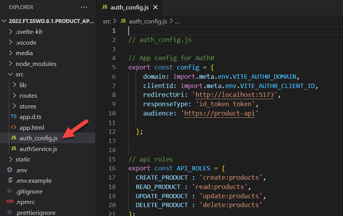

Also add variables for your Auth0 `DOMAIN`  and  `CLIENT_ID` to the `.env` file:

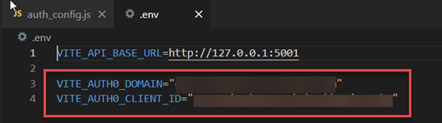

**Important:** You will need to obtain the correct values from your **Auth0** account – see the settings for the API and client web in the Auth0 setup
tutorial.

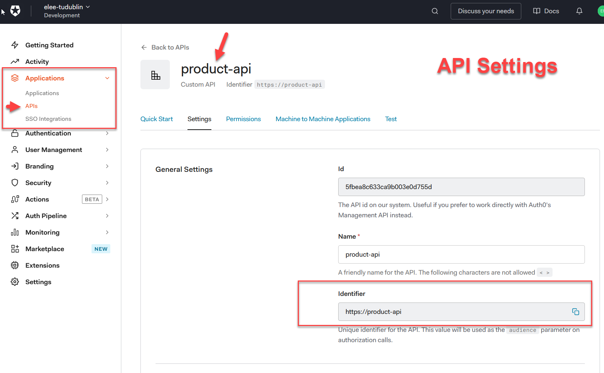

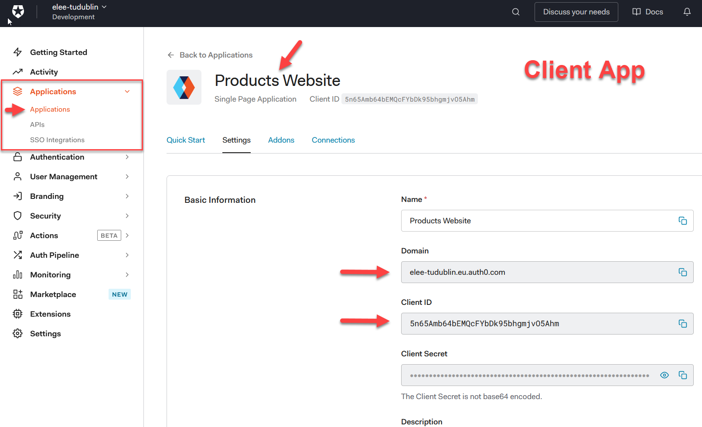

Code already in project - **but you will need to add your own values for `VITE_AUTH0_DOMAIN` and `VITE_AUTH0_CLIENT_ID`** (to `.env`)

### 1.1. **auth-config.js**

```javascript
// auth_config.js

// App config for Auth0
export const config = {
    domain: import.meta.env.VITE_AUTH0_DOMAIN,
    clientId: import.meta.env.VITE_AUTH0_CLIENT_ID,
    redirectUri: 'http://localhost:5173',
    responseType: 'id_token token',
    audience: 'https://product-api'

  };


// api roles
export const API_ROLES = {
  CREATE_PRODUCT : 'create:products',
  READ_PRODUCT : 'read:products',
  UPDATE_PRODUCT : 'update:products',
  DELETE_PRODUCT : 'delete:products'
};

```


### 1.2. The `authStore`

Add `authStore.js` to the `/scr/stores/` folder. It will be used to persist details for authorised users.

```javascript
// https://auth0.com/blog/authenticating-svelte-apps/

import { writable, derived } from "svelte/store";

export const isAuthenticated = writable(false);
export const user = writable({});
export const roles = writable({});
export const token = writable();
export const popupOpen = writable(false);
export const error = writable();
```


### 1.3. Auth0 Functions

Auth0 provides an API to hand user authentication, registration, etc. This example is based on the documentation provided,

e.g. https://developer.auth0.com/resources/code-samples/spa/svelte

#The following npm packages are required:

```bash
npm install @auth0/auth0-spa-js

npm install jwt-decode
```

**`/src/authService.js`** includes the required functions to handle user login, logout, as will as  checking roles and authorization.

```javascript
// src/authService.js

// https://auth0.com/blog/authenticating-svelte-apps/
// https://developer.auth0.com/resources/code-samples/spa/svelte

// Import the Auth0 Library
import { createAuth0Client } from '@auth0/auth0-spa-js';

// Import the auth store
import { user, isAuthenticated, token, roles, popupOpen } from './stores/authStore';

// A lib for decoding JWTs
import jwt_decode from "jwt-decode";

// import config settings
import  { config, API_ROLES } from "./auth_config";

// Create an Auth0 client
async function createClient() {
  let auth0Client = await createAuth0Client({
    domain: config.domain,
    clientId: config.clientId,
    authorizationParams: { 
      redirect_uri: config.redirectUri,
      audience: config.audience,
      responseType: 'id_token token'
    }
  });

  return auth0Client;
}


// A Function to manage Auth0 login and registration 
async function loginWithPopup(client, options) {
  popupOpen.set(true);
  try {
    // Login using a pop up dialog
    await client.loginWithPopup(options);

    // Set the user store after login
    user.set(await client.getUser());
    isAuthenticated.set(true);

    // Get the access token generated after authentication
    const jwt = await client.getTokenSilently(options); 
    token.set(jwt);

    // call set roles function
    setRoles(jwt);

  } catch (e) {
    // eslint-disable-next-line
    console.error(e);
  } finally {
    popupOpen.set(false);
  }
}

// An alternative login dialog
async function loginWithRedirect(client, options) {
  popupOpen.set(true);
  try {
    await client.loginWithRedirect(options);

    user.set(await client.getUser());
    isAuthenticated.set(true);
    const jwt = await client.getTokenSilently(options); 
    token.set(jwt);
    setRoles(jwt);

  } catch (e) {
    // eslint-disable-next-line
    console.error(e);
  } finally {
    popupOpen.set(false);
  }
}

// Logout - clears the session
function logout(client) {
  return client.logout();
}

// Read user roles from the access token using the npm_decode package.
// This does not verify the token - do that server side
function setRoles(jwt) {
  if (!jwt) {
    roles.set({
      showUpdate: false,
      showDelete: false,
      showAdd: false
    });

  } else {
    const decoded = jwt_decode(jwt);
    console.log('decode: ', decoded);

    // set the user roles in the store, these will be used to dettermine access right later
    roles.set({
      showUpdate: decoded.permissions.includes(API_ROLES.UPDATE_PRODUCT),
      showDelete: decoded.permissions.includes(API_ROLES.DELETE_PRODUCT),
      showAdd: decoded.permissions.includes(API_ROLES.CREATE_PRODUCT)
    });
  }
}


const auth = {
  createClient,
  loginWithPopup,
  loginWithRedirect,
  logout
};

export default auth;


```


## 2. Add HTML links for Login and Logout

The navigation menu is defined in `/routes/+layout.svelte` Modify the `<script>` section of the `layout` to setup the Auth0 client and define necessary functions:

```html
<script>
	import { onMount } from 'svelte';
	import { isAuthenticated, user } from '../stores/authStore';
	import auth from '../authService';

	let auth0Client = null;

	// onMount runs after the page loads
	onMount(async () => {
		// Setup Auth0 client
		auth0Client = await auth.createClient();
		// Set the authenticated state in the store
		isAuthenticated.set(await auth0Client.isAuthenticated());
		// Get the logged in user - if any
		user.set(await auth0Client.getUser());
	});

	// Handle login requests - e.g. clicking the link
	// login via the client
	const login = () => {
		console.log('login');
		auth.loginWithPopup(auth0Client);
	};

	// Handle logout requests - e.g. clicking the link
	const logout = () => {
		auth.logout(auth0Client);
	};
</script>
```


### 2.1. Add The links

The login and logout links will be displayed in the menu, next to the other links. 

When a user is not logged in, the Login link will be displayed:

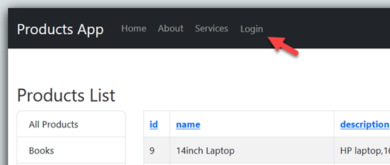


Clicking the link will call the `login()` function which in turn will use the Auth0 client to handle authentication:

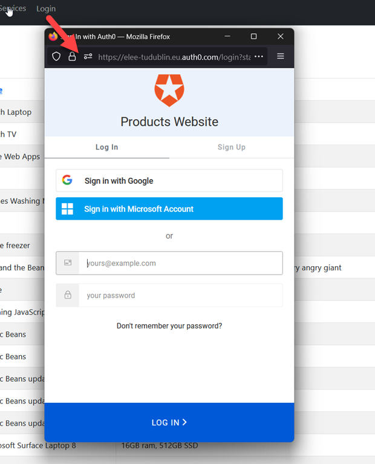


After Successful login, the Logout link should be displayed instead of Login:

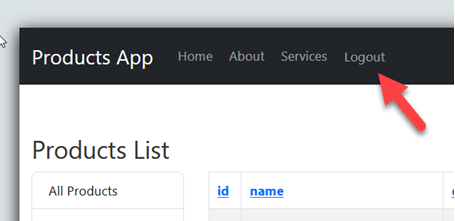


### 2.2 Using a conditional to show the correct link

The value of `$isAuthenticated` from `authStore.js` is used to determine which link to show. If false show login, otherwise show logout. This statement replaces the existing placeholder login link:


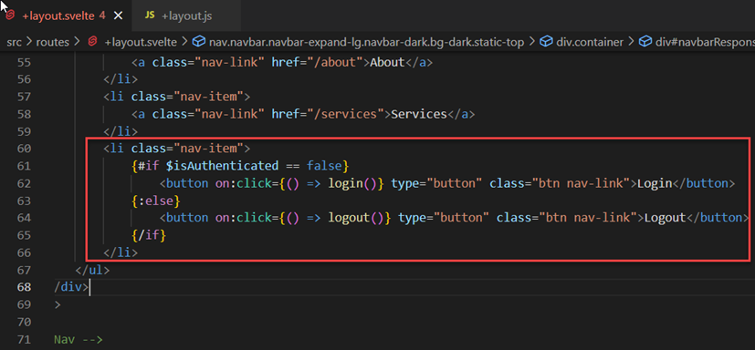


**`+layout.svelte`** navigation menu:

```html
<!-- Navigation -->
<nav class="navbar navbar-expand-lg navbar-dark bg-dark static-top">
	<div class="container">
		<a class="navbar-brand" href="/">Products App</a>
		<button
			class="navbar-toggler"
			type="button"
			data-toggle="collapse"
			data-target="#navbarResponsive"
			aria-controls="navbarResponsive"
			aria-expanded="false"
			aria-label="Toggle navigation"
		>
			<span class="navbar-toggler-icon" />
		</button>
		<div class="collapse navbar-collapse" id="navbarResponsive">
			<ul class="navbar-nav ml-auto">
				<li class="nav-item active">
					<a class="nav-link" href="/"
						>Home
						<span class="sr-only" />
					</a>
				</li>
				<li class="nav-item">
					<a class="nav-link" href="/about">About</a>
				</li>
				<li class="nav-item">
					<a class="nav-link" href="/services">Services</a>
				</li>
				<li class="nav-item">
					{#if $isAuthenticated == false}
						<button on:click={() => login()} type="button" class="btn nav-link">Login</button>
					{:else}
						<button on:click={() => logout()} type="button" class="btn nav-link">Logout</button>
					{/if}
				</li>
			</ul>
		</div>
	</div>
</nav>
<!-- End Nav -->
```


### 2.3  `/src/routes/+page.svelte`

Load dependencies then log results in the console to see if it works. This code should be added just after the existing import statement.

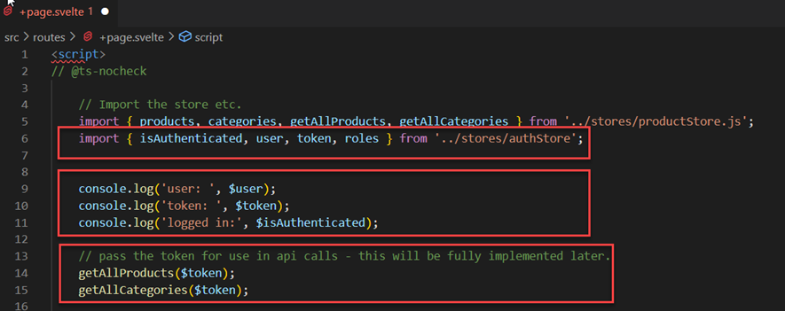

```javascript
	import { isAuthenticated, user, token, roles } from '../stores/authStore';

	console.log('user: ', $user);
	console.log('token: ', $token);
	console.log('logged in:', $isAuthenticated);

	// pass the token for use in api calls - this will be fully implemented later.
	getAllProducts($token);
    getAllCategories($token);
```


Also display the token at the bottom of the page:

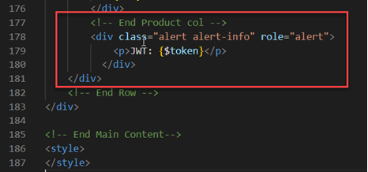


`/src/stores/productStore.js`has been updated to use the `token` parameter when calling the api (next lab).

### 2.4 Exercise

Work your way back through the code to figure out how the login and logout process works. Use `console.log()` statements to show values at each stage.


## 3. Try it out

Start the server API so that it is running on <http://localhost:5001> Then client-side website **must be hosted** in a webserver for this to work.

Start the client on http://localhost:5173

Then open in a browser and follow the Login link. This should show direct to the default Auth0 login page for your Auth0 domain). Note that the form also includes options for signing up, password recovery, and login via Google or Microsoft. All these options are configurable in the Auth0 website.
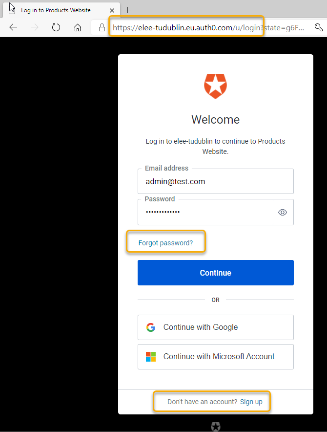

Sign in using the Admin account created earlier. After login, you will be
redirected back to the client website <http://localhost:5173


### Get the token

After login The token is logged in the browser console  and is also displayed at the bottom of the page:

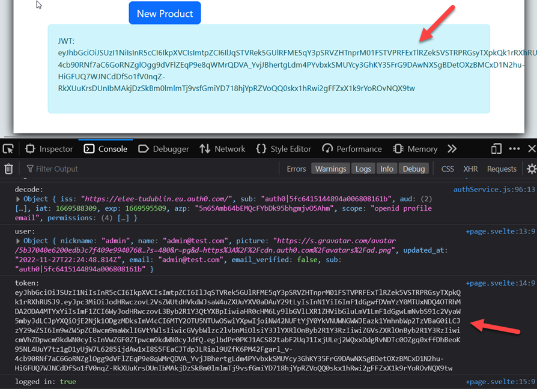

### Decoding the token

Permissions for the token can be checked using <http://jwt.io> Copy the **accessToken** value from your browser and paste into the JWT debugger tool.
Note the permissions for this user:

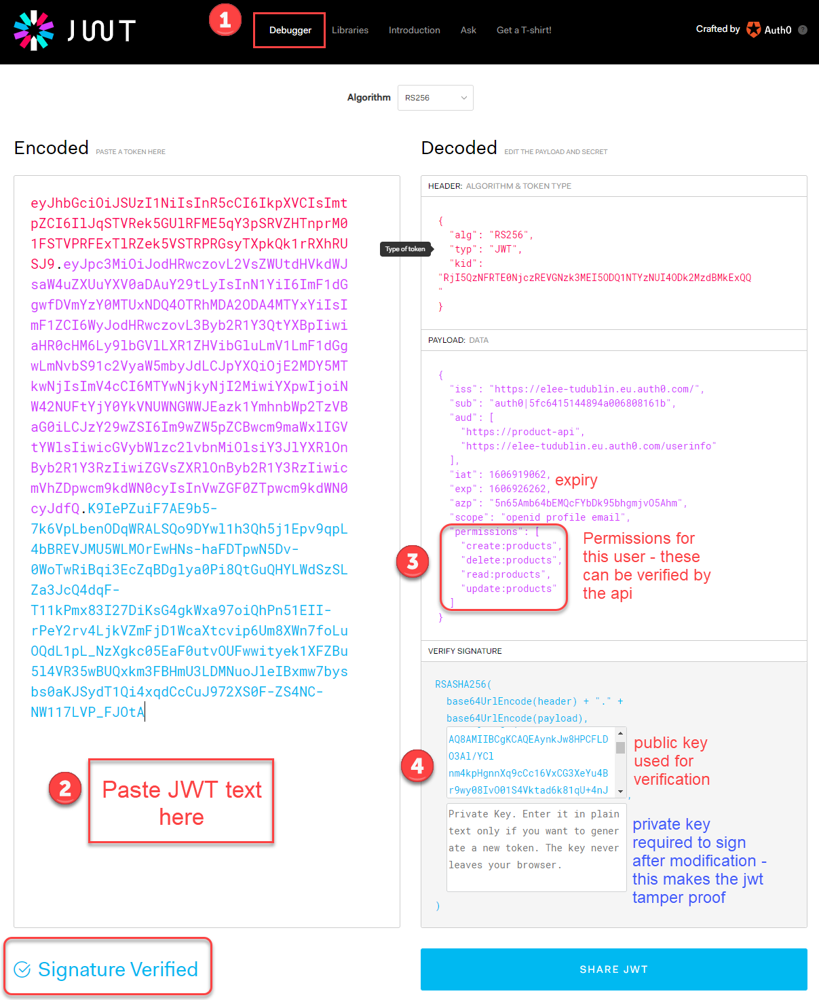

## 5. Client-side Authorization

**Important**: This does not replace server-side validation and access control as client-side checking can be bypassed easily. Ideally a separate admin controller on the server-side should be accessed by a specialised administration site (e.g., host an admin site in addition to the  public site).

Client-side authentication and authorization is difficult and unreliable as an attacker will have access to the JavaScript code. However, it may be useful to display UI elements based on the user type. For example, only show buttons for add product, update, and delete when the user has permission to access those functions.

Roles for the API are defined in **auth0-variables.js**:


After a user logs in successfully, Auth0 returns an access token (JWT) which contains list of roles/ permissions assigned to that user. The **`setRoles()`** function (**authService.js**) is used to check which permissions are contained in the token which can then be checked before granting access to protected resources. It sets an object named `roles` in the store.

```javascript
// Read user roles from the access token using the npm_decode package.
// This does not verify the token - do that server side
function setRoles(jwt) {
  if (!jwt) {
    roles.set({
      showUpdate: false,
      showDelete: false,
      showAdd: false
    });

  } else {
    const decoded = jwt_decode(jwt);
    console.log('decode: ', decoded);

    // set the user roles in the store
    roles.set({
      showUpdate: decoded.permissions.includes(API_ROLES.UPDATE_PRODUCT),
      showDelete: decoded.permissions.includes(API_ROLES.DELETE_PRODUCT),
      showAdd: decoded.permissions.includes(API_ROLES.CREATE_PRODUCT)
    });
  }
}

```


### 5.1 Show Add, update, and delete buttons based on user access rights
The user roses set in the `authStore` can be used to determine if these buttons should be displayed. Note the `{#if}{/if}` blocks. The content in these sections is only added if the `$roles` value is true. in **`/src/routes/page.svelte`**
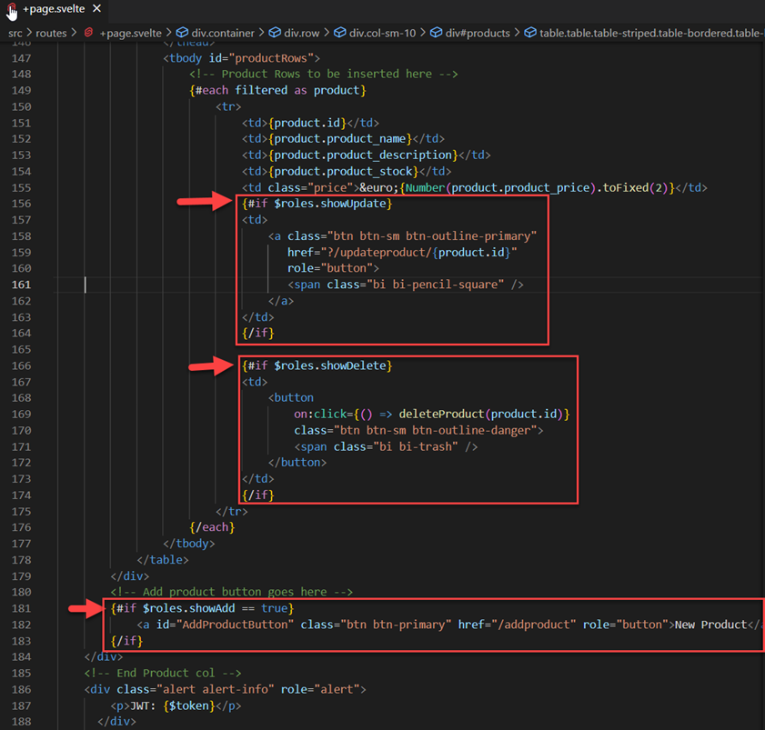


```html
					<tbody id="productRows">
						<!-- Product Rows to be inserted here -->
						{#each filtered as product}
							<tr>
								<td>{product.id}</td>
								<td>{product.product_name}</td>
								<td>{product.product_description}</td>
								<td>{product.product_stock}</td>
								<td class="price">&euro;{Number(product.product_price).toFixed(2)}</td>
								{#if $roles.showUpdate}
								<td>
									<a class="btn btn-sm btn-outline-primary"
									   href="?/updateproduct/{product.id}"
									   role="button">
									   <span class="bi bi-pencil-square" />
									</a>
								</td>
								{/if}
								
								{#if $roles.showDelete}
								<td>
									<button
										on:click={() => deleteProduct(product.id)}
										class="btn btn-sm btn-outline-danger">
										<span class="bi bi-trash" />
									</button>
								</td>
								{/if}
							</tr>
						{/each}
					</tbody>
				</table>
			</div>
			<!-- Add product button goes here -->
			{#if $roles.showAdd == true}
				<a id="AddProductButton" class="btn btn-primary" href="/addproduct" role="button">New Product</a>
			{/if}
		</div>
```


## 6. Test
Login as each of the three user types and compare.


------

Enda Lee 2022
